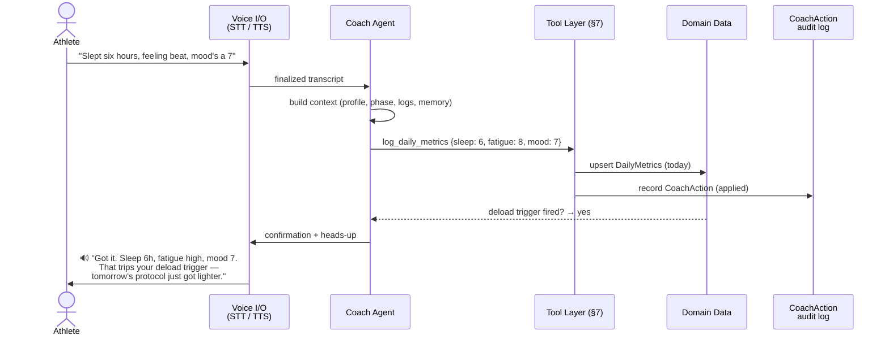

# 🎙️ Voice AI Coach — Write-Capable Agent

**Spec v2 · Vantage / Project IronMind**

| | |
|---|---|
| **Status** | Draft — ready for build |
| **Owner** | Jordan Kling |
| **Scope** | Coach write path: function-calling tools, nutrition logging, audit + undo |
| **Out of scope (v1)** | Auth, multi-user, third-party writes (Strava push), always-listening mode |

---

## 1. The one-liner

> **Talk to your coach and it does the work.** Say what happened — a ride, a meal, a rough night of sleep — and the Coach writes it into your real data: workouts, nutrition, daily metrics, the training plan, your checklists. Every write is confirmed out loud, logged to an audit trail, and undoable with one command.

Today's Coach is a great *listener*: it answers with your full context (profile, phase, recent logs, journal, books, memory). This spec upgrades it to a great *assistant* — a **write-capable agent**, not just a talking encyclopedia.

```
"I did a 40-mile ride, felt good, HR in the 140s."
        │
        ▼
┌─────────────────────────────────────────────────┐
│  COACH (agent loop)                             │
│  intent → tool call → write → confirm → audit   │
└─────────────────────────────────────────────────┘
        │
        ▼
✅ "Logged it — 40-mile ride, feeling good, HR 140s.
    That's your longest ride this block. Anything to add?"
```

---

## 2. What you can say (core scenarios)

Five utterance families define v1. Each one maps to exactly one tool in §7.

| You say… | The Coach… | Tool |
|---|---|---|
| *"I did a 40-mile ride, felt good, HR in the 140s."* | Logs the workout with distance, feel, and HR range | `log_workout` |
| *"For breakfast I had oatmeal, a banana, and three eggs."* | Logs the meal and estimates calories + macros | `log_meal` |
| *"Slept six hours, feeling beat, mood's a 7."* | Records today's sleep/fatigue/mood → feeds the deload engine | `log_daily_metrics` |
| *"Swap tomorrow's run for a swim, knee's cranky."* | Adjusts the plan *through the training engine*, reason attached | `adjust_plan` |
| *"Check off book race-week lodging."* | Marks the matching checklist item complete | `toggle_checklist_item` |

> [!NOTE]
> **Persona:** one athlete, one goal race, often hands-free — post-workout, driving, cooking. Voice-first, but everything works identically over text.

---

## 3. Architecture at a glance



Design rule that falls out of this diagram: **the Coach never edits domain data directly.** It calls tools; tools write; every write leaves a `CoachAction` behind. One path in, one audit trail out.

---

## 4. Voice interface

- **Input** — Web Speech API for capture; finalized utterances stream to the Coach as text. STT sits behind a pluggable provider interface, so hosted transcription (e.g. Whisper) is a drop-in swap with zero Coach changes.
- **Output** — every response is simultaneously **spoken (TTS) and rendered as chat text**. Mic muted? Sound off? Nothing breaks.
- **Turn-taking** — push-to-talk in v1. Full-duplex "always listening" is a future extension, deliberately not required here.
- **Degradation** — unsupported browsers get a disabled mic with an inline explanation; text chat and the entire write path are unaffected.
- **Mock mode** — with no API key, the deterministic mock coach still exercises the full tool loop (intent → write → confirm → audit), so the write path is testable keyless.

---

## 5. Data model

### 5.1 Existing entities (referenced, unchanged)

| Entity | Role in this spec |
|---|---|
| `Workout` | Target of `log_workout` — type, duration/distance, feel note, HR data |
| `DailyMetrics` | Target of `log_daily_metrics` — the exact table the engine's deload/reset triggers read |
| `Plan` / `Session` | Adjusted via `adjust_plan` — always through the training engine |
| `ChecklistItem` | Target of `toggle_checklist_item` |

### 5.2 New: `NutritionLog` 🍳

Food had **nowhere to live** in the schema. This fixes that.

```ts
interface NutritionLog {
  id: string
  loggedAt: string              // ISO datetime
  meal: "breakfast" | "lunch" | "dinner" | "snack"   // stated, else inferred from time of day
  rawText: string               // "oatmeal, a banana, and three eggs" — always preserved verbatim
  items: NutritionItem[]
  estimatedCalories: number     // sum of items
  estimatedMacros: Macros
  source: "voice" | "text"
}

interface NutritionItem {
  name: string
  quantity: string              // as spoken: "1 banana", "three eggs"
  estimatedCalories: number
  estimatedMacros: Macros
}

interface Macros { proteinG: number; carbsG: number; fatG: number }
```

> [!IMPORTANT]
> Estimates come from the model in the same constrained-JSON tool call — not a nutrition-database lookup. The UI **always labels them as estimates**. No false precision, ever.

### 5.3 New: `CoachAction` — the audit log 🧾

Every write the Coach makes, in one place, forever:

```ts
interface CoachAction {
  id: string
  createdAt: string
  tool: string                  // "log_workout" | "log_meal" | ...
  utterance: string             // the exact user text that triggered it
  input: object                 // arguments the model produced
  targetType: string            // "Workout" | "NutritionLog" | ...
  targetId: string
  result: "applied" | "undone" | "failed"
  confirmationText: string      // what the Coach said back
}
```

This table is the single source of truth for the write path. "Show me everything the Coach changed this week" is one query. Undo is one row-flip plus one revert.

---

## 6. Safety model

Four rules, no exceptions:

1. **🔊 No silent writes.** Every tool call produces a plain-language confirmation, spoken and written: *"Logged a 40-mile ride, feeling good, HR 140s — anything to add?"*
2. **↩️ Undo, not edit-in-place.** *"Undo that"* reverts the domain record and flips the `CoachAction` to `"undone"`. History is never silently mutated.
3. **🤔 Clarify, don't guess.** Missing required fields (*"log a workout"* — which one?) → the Coach asks a follow-up. It never fabricates placeholder data to force a tool call through.
4. **🔒 Own data only.** Tools touch the current athlete's records exclusively. There is no bulk-delete tool; the only destructive operation is undoing a specific just-made action.

---

## 7. The tool layer (function-calling)

The Coach gets a fixed toolset. Per turn it selects **zero or one** tool; a compound utterance (*"log the ride and check off lodging"*) is handled as sequential calls within the turn. Every successful call = exactly one write + one confirmation + one `CoachAction`.

### 7.1 `log_workout` 🚴

| | |
|---|---|
| **Triggers on** | descriptions of completed training sessions |
| **Input** | type · duration and/or distance · subjective feel · HR range/avg (opt) · notes (opt) · date (defaults today) |
| **Writes** | one `Workout` |
| **Confirms** | restates type, distance/duration, feel |

*"I did a 40-mile ride, felt good, HR in the 140s"* → `{type: "ride", distanceMi: 40, feel: "good", hrRange: "140s"}`

### 7.2 `log_meal` 🍳

| | |
|---|---|
| **Triggers on** | descriptions of food eaten |
| **Input** | free-text food list · meal label (stated, else inferred from clock) |
| **Writes** | one `NutritionLog` (§5.2), items + macros estimated in the same call |
| **Confirms** | restates items + estimated total, explicitly flagged as an estimate |

*"For breakfast I had oatmeal, a banana, and three eggs"* → 3 items, breakfast, ~550 kcal est.

### 7.3 `log_daily_metrics` 😴

| | |
|---|---|
| **Triggers on** | statements about sleep, energy/fatigue, or mood |
| **Input** | any subset of `{sleepHours, fatigue 1–10, mood 1–10}` — **partial updates required** |
| **Writes** | upserts today's `DailyMetrics` — the exact table the engine's deload/reset triggers read; a write here can change tomorrow's protocol immediately |
| **Confirms** | restates what was recorded — **and says so out loud if a deload/reset trigger fired** |

*"Slept six hours, feeling beat, mood's a 7"* → `{sleepHours: 6, fatigue: 8 /* inferred from "beat" */, mood: 7}`

### 7.4 `adjust_plan` 🔁

| | |
|---|---|
| **Triggers on** | requests to change an upcoming session, or a reason forcing one (injury, schedule) |
| **Input** | target date (defaults to next matching session) · replacement type or `"skip"` · reason |
| **Writes** | calls **into the training engine** to swap/annotate — never a direct plan edit — so injury-aware swaps and fueling recalculation stay consistent |
| **Confirms** | restates the swap and the recorded reason |

*"Swap tomorrow's run for a swim, knee's cranky"* → tomorrow: swim, reason: `"knee"`.

### 7.5 `toggle_checklist_item` ✅

| | |
|---|---|
| **Triggers on** | marking a named task done / not done |
| **Input** | item name (fuzzy-matched against open items) · target state (defaults complete) |
| **Writes** | toggles the matched `ChecklistItem` |
| **Confirms** | restates item + new state |

*"Check off book race-week lodging"* → **Book race-week lodging** → ✅

> [!WARNING]
> No confident fuzzy match → the Coach lists the closest candidates and asks. It never creates a new item or toggles a guess.

---

## 8. Definition of Done

The feature ships when **every** box is checked:

- [ ] `NutritionLog` and `CoachAction` exist in the schema, with migrations.
- [ ] All five §7 tools implemented behind the function-calling layer, each with a test exercising its example utterance end-to-end.
- [ ] Every successful tool call → exactly one `CoachAction` + one plain-language confirmation.
- [ ] `log_daily_metrics` writes are visible to the deload/reset triggers with **no separate sync step**.
- [ ] `adjust_plan` routes through the training engine — direct plan edits are impossible from the Coach.
- [ ] Ambiguous utterances produce a clarifying question, never a guessed tool call.
- [ ] Every applied `CoachAction` is undoable; undo reverts the domain record and marks the action `"undone"`.
- [ ] Works across all four modes: **voice × text** input, **live-API × keyless mock** coach.

---

*Systems over goals · Consistency over intensity · The Coach that writes it down is the Coach you actually use.*
